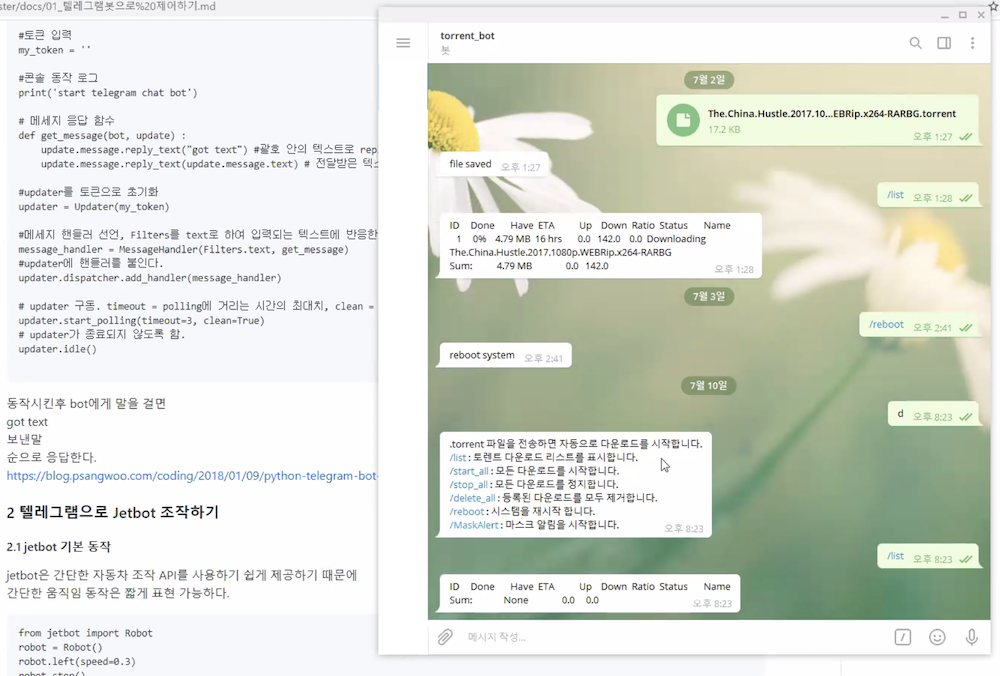

# kakao-bot

# 목표
메신저로 터틀봇3 조종하기 / 메이커 페어 서울 2020 출품

# 일정
- 2020년 7월 1주: 아이스브레이킹/모임 일정 확정
- 2020년 7월 2주~7월 4주: 오픈소스 따라하기 1
- 2020년 7월 5주~8월 3주: 오픈소스 따라하기 2
- 2020년 8월 4주~9월 4주: 신규 프로젝트 수행
- 2020년 10월 1주: 데모 데이
- 2020년 10월 17~18일: 메이커페어 서울 2020 참가
- 일정 상세 스케쥴: [메신저터틀봇일정_20200703](https://github.com/orocapangyo/kakao-bot/blob/master/files/%EB%A9%94%EC%8B%A0%EC%A0%80%ED%84%B0%ED%8B%80%EB%B4%87%EC%9D%BC%EC%A0%95_20200703.xlsx)

# 슬랙 방 정보
- 카톡봇으로 로봇 제어하기: https://orocapangyo.slack.com/archives/C010HBRA3H7

# 참고자료
- 텔레그램 ROS	https://github.com/tue-robotics/telegram_ros
- 텔레그램으로 로봇 제어	https://github.com/uts-magic-lab/telegram_robot
  
- ROS 하루에 입문하기  https://robertchoi.gitbook.io/ros/
- ROS2 하루에 입문하기 https://robertchoi.gitbook.io/ros2/
  
- 터틀봇 제품 소개	https://www.robotis.com/shop/item.php?it_id=901-0118-200#sit_rel
- e-매뉴얼	https://emanual.robotis.com/docs/en/platform/turtlebot3/overview/
- 터틀봇 홈페이지	https://www.turtlebot.com/
- ROS 커뮤니티	https://discourse.ros.org/
- Turtlebot 깃허브	https://github.com/robotis-git/turtlebot3
- 터틀봇 STL 도면	https://cad.onshape.com/documents/2586c4659ef3e7078e91168b/w/14abf4cb615429a14a2732cc/e/9ae9841864e78c02c4966c5e
  

# 모임 후기
## 2020년 7월 3일
- 모임 시간: 7월 3일 금요일 20시~21시
- 모임 장소: ZOOM을 통한 온라인 미팅
- 참석자: 우희도, 원종윤, 이건희, 최규남, 최성준, 홍재권
- 내용:
    - 구성원들의 숙련도 확인
        - 라즈베리파이, 아두이노 경험 있는 인원 있음
        - C++, Python 경험 있는 인원 있음
        - 머신러닝, 딥러닝, 강화학습 경험 있는 인원 있음
        - 텔레그램 써본 인원 있음
        - 젯봇 보유/사용해본 인원 있음
    - 논의된 사항
        - 메이커 페어에 참여한 작품 영상 공유
        - 메이커 페어 서울 2020 참가 여부는 아직 미정
        - 카톡봇에 대한 설명
            - 공기계에서 카카오 아이디 만들어서 사람처럼 공기계와 채팅 가능하다. 
            - 단톡방 메시지 후킹해서 서버로 보내서 처리 가능하다.
        - 슬랙에서의 Incoming Hooking 예제 공유
            - 카톡봇은 Outcoming Hooking 활용 가능할 것으로 보인다.
    - 결정된 사항
        - 코드들은 깃허브에 올린다. 
          참고: [깃허브(Github) fork/pull request/merge 방법](https://blog.naver.com/pcmola/222026183913)
        - 코로나 사태가 진정되기까지 일단 모임은 온라인으로 한다:  
          매주 금요일 오후 8시에 모임 진행
        - 다음 모임에는 텔레그램으로 젯봇 제어하는 시연을 한다(이건희 님)

## 2020년 7월 10일
- 모임 시간: 7월 10일 금요일 20시~21시
- 모임 장소: ZOOM을 통한 온라인 미팅
- 참석자: 김진성, 김효민, 우희도, 원종윤, 이건희, 이태용, 최규남, 최성준, 홍재권
- 내용: 
    - 텔레그램으로 터틀심 제어하기 예제 발표
        - 발표자: 이건희 님
        - 요약: 
            1) 텔레그램 봇을 구현하였다. 
            2) 텔레그램을 통해 Jetbot 조작하는 것까지 성공하였다(젯슨 나노 기준).
            3) 파이썬으로 터틀심 제어까지 성공하였다.
            4) 텔레그램으로 터틀심 작동까진 되지 않았다:  현재 텔레그램봇은 python3 만 지원하고 rospy 모듈은 python3에서 동작하지 않아 구현이 불가능했다.
        - 발표자료: [텔레그램봇으로 제어하기](https://github.com/orocapangyo/kakao-bot/blob/master/docs/01_%ED%85%94%EB%A0%88%EA%B7%B8%EB%9E%A8%EB%B4%87%EC%9C%BC%EB%A1%9C%20%EC%A0%9C%EC%96%B4%ED%95%98%EA%B8%B0.md)
        - 텔레그램봇 시연 이미지:
        
    - 추가 토의
        - python3 에러 처리 방법
            - import yaml 관련 python 에러 발생 시
            <pre>pip3 install pyyaml</pre>
            - 마찬가지로 rospkg를 못 찾으면 다음과 같이 한다.
            <pre>pip3 install rospkg</pre>
            --> 미팅 시간에는 여기까지 해도 계속 에러가 발생했다.  
            에러 안 나고 텔레그램으로 터틀심 돌리는 방법에 대해서는 각자 조사하도록 한다.            
        - 젯슨 나노 대신 ROS 써야 하는 이유는?  
        --> PC로 제어하기 위해서는 ROS가 필요하다.
    - 다음주까지 각자 할 일
        - 텔레그램을 통해서 터틀심을 돌려볼 수 있도록 한다.
        - 성공한 사람이 있으면 공유할 수 있도록 준비한다.
 